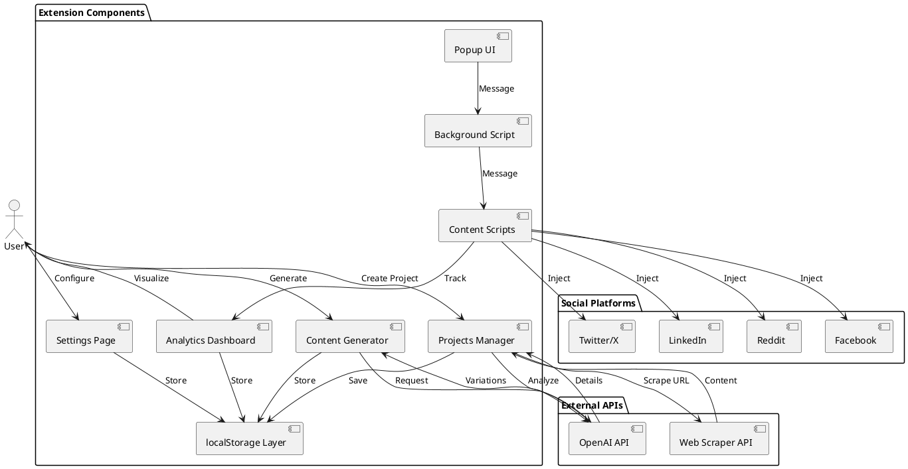
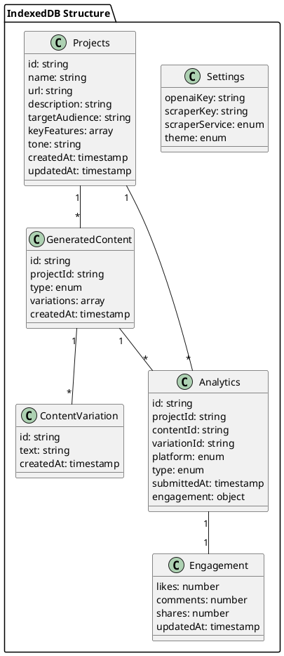
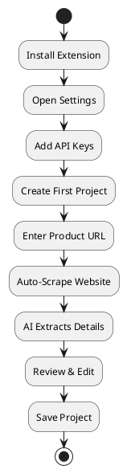
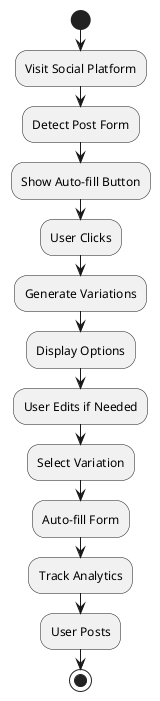
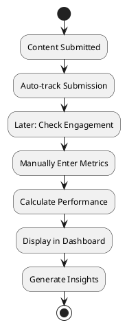

# DefPromo - Architecture Documentation

## Overview
Cross-browser web extension for automated social media self-promotion with AI-generated content, comprehensive analytics, and A/B testing capabilities.

## Tech Stack
- **Frontend**: React + JavaScript (ES6+)
- **Styling**: Tailwind CSS
- **Build Tool**: Vite
- **Storage**: IndexedDB with Dexie.js wrapper
- **APIs**: OpenAI API, Web Scraper API (ScrapingBee/ScraperAPI/Browserless)

## Architecture Diagram



## Data Schema



## Project Structure
```
defpromo/
├── src/
│   ├── popup/
│   │   ├── App.jsx              # Main popup component
│   │   ├── index.jsx            # Popup entry point
│   │   └── index.html           # Popup HTML
│   │
│   ├── settings/
│   │   ├── Settings.jsx         # Settings page component
│   │   ├── index.jsx            # Settings entry point
│   │   └── index.html           # Settings HTML
│   │
│   ├── components/
│   │   ├── ProjectCard.jsx      # Project display card
│   │   ├── ProjectForm.jsx      # Create/edit project form
│   │   ├── ContentGenerator.jsx # Content generation UI
│   │   ├── ContentVariation.jsx # Single variation display
│   │   ├── AnalyticsDashboard.jsx # Main analytics view
│   │   ├── AnalyticsCharts.jsx  # Chart components
│   │   ├── EngagementTracker.jsx # Engagement input form
│   │   ├── PerformanceView.jsx  # Best content analysis
│   │   └── ExportImport.jsx     # Data export/import UI
│   │
│   ├── content/
│   │   ├── twitter.js           # Twitter content script
│   │   ├── linkedin.js          # LinkedIn content script
│   │   ├── reddit.js            # Reddit content script
│   │   ├── facebook.js          # Facebook content script
│   │   └── shared.js            # Shared content script utilities
│   │
│   ├── background/
│   │   └── service-worker.js    # Background service worker
│   │
│   ├── services/
│   │   ├── openai.js            # OpenAI API integration
│   │   ├── scraper.js           # Web scraper API integration
│   │   └── analytics.js         # Analytics calculations
│   │
│   ├── storage/
│   │   ├── db.js                # Dexie.js IndexedDB setup
│   │   ├── projects.js          # Project CRUD operations
│   │   ├── content.js           # Content CRUD operations
│   │   ├── analytics.js         # Analytics CRUD operations
│   │   ├── settings.js          # Settings operations
│   │   └── migrations.js        # Database schema migrations
│   │
│   ├── utils/
│   │   ├── platform-detector.js # Detect current platform
│   │   ├── form-finder.js       # Find post/comment forms
│   │   ├── messaging.js         # Extension messaging helpers
│   │   └── export-import.js     # JSON export/import with validation
│   │
│   └── styles/
│       └── global.css           # Global Tailwind styles
│
├── public/
│   ├── manifest.json            # Extension manifest
│   ├── icons/                   # Extension icons
│   └── _locales/                # Internationalization (optional)
│
├── dist/                        # Build output
├── package.json
├── vite.config.js
├── tailwind.config.js
└── postcss.config.js
```

## Key Features

### 1. Project Management
- Create projects by entering product URL
- Auto-scrape website content using external API
- AI analyzes scraped content to extract product details
- Edit project details manually
- Switch between multiple projects
- Delete projects with confirmation

### 2. Content Generation
- Generate 3-5 content variations per request
- Support for both posts and comments
- Inline editing before use
- Content history with timestamps
- Filter by project, platform, and type

### 3. Analytics & Insights
- **Submission Tracking**: Automatic tracking when content is used
- **Engagement Metrics**: Manual entry for likes, comments, shares
- **Time-Series Charts**: Submissions over time with date range filters
- **Platform Comparison**: Visual comparison across platforms
- **A/B Testing**: Compare performance of different variations
- **Best Performers**: Identify top-performing content
- **Performance Scoring**: Algorithmic scoring based on engagement

### 4. Platform Integration
- Detect post/comment forms automatically
- Inject subtle auto-fill button near forms
- One-click content insertion
- Support for Twitter/X, LinkedIn, Reddit, Facebook
- Platform-specific form field mapping

### 5. Data Management
- All data stored in IndexedDB (better for large datasets)
- Dexie.js wrapper for easier IndexedDB operations
- Export entire dataset to JSON (one-click backup)
- Import from JSON with validation and merge options
- Data migration support for schema updates
- Cross-browser and cross-machine portability
- No backend or server required
- Privacy-focused design

## User Flows

### Initial Setup Flow


### Content Generation Flow


### Analytics Flow


## Technical Considerations

### Cross-Browser Compatibility
- Use Manifest V3 for Chrome, Edge, Opera
- Firefox compatibility with manifest adjustments
- Safari requires additional conversion steps
- Separate build configurations per browser

### Performance
- Lazy load analytics charts
- Debounce API calls
- Cache scraped content
- IndexedDB for efficient large dataset storage
- Use virtual scrolling for large lists
- Indexed queries for fast data retrieval

### Data Portability
- Complete export of all data to single JSON file
- Import with data validation and error handling
- Merge strategies for importing into existing data
- Automatic backup reminders
- Version tracking in exports for compatibility

### Security
- API keys stored securely in IndexedDB
- No sensitive data sent to external servers except to user-configured APIs
- Content Security Policy in manifest
- Validate all user inputs
- Sanitize scraped content before AI processing
- Export files contain sensitive data - warn users

### Error Handling
- Graceful API failure handling
- Offline mode support
- Form detection fallbacks
- User-friendly error messages
- Retry mechanisms for API calls

## Development Phases

### Phase 1: Foundation (Tasks 1-4)
- Project setup
- Core data layer
- Basic UI structure

### Phase 2: Core Features (Tasks 5-10)
- Settings management
- Project CRUD
- Content generation
- Content history

### Phase 3: Analytics (Tasks 11-18)
- Analytics dashboard
- Tracking implementation
- Engagement tracking
- Performance insights

### Phase 4: Platform Integration (Tasks 19-25)
- Content scripts
- Platform detection
- Auto-fill functionality
- Message passing

### Phase 5: Polish & Deploy (Tasks 26-30)
- Styling
- Error handling
- Browser builds
- Testing
- Documentation